# Примеры диаграмм и блок-схем в Mermaid

В этом файле собраны основные типы диаграмм, которые можно строить с помощью синтаксиса Mermaid в Markdown.

## 1. Блок-схема (Flowchart)
Отображает алгоритмы, логику процессов и разветвления условий.

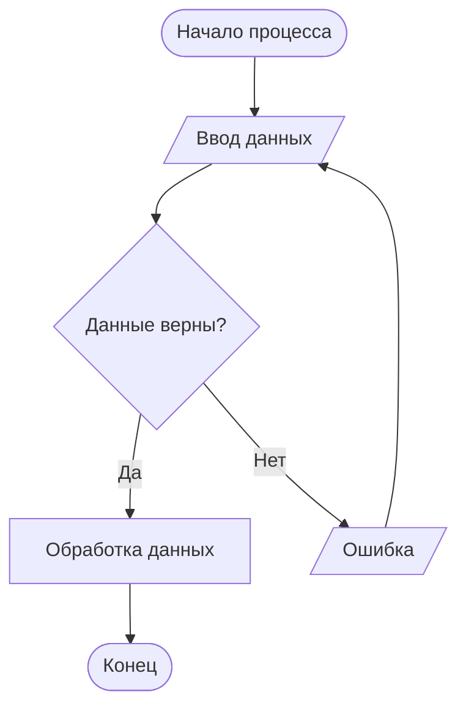

## 2. Диаграмма Ганта (Gantt Chart)
Используется для планирования задач, управления проектами и отображения временных шкал.

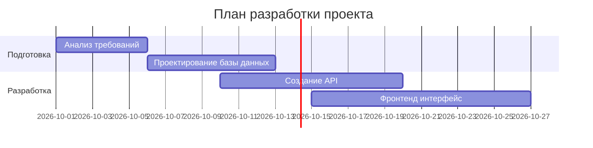

## 3. Круговая диаграмма (Pie Chart)
Отлично подходит для наглядного отображения долей, процентов или статистики.

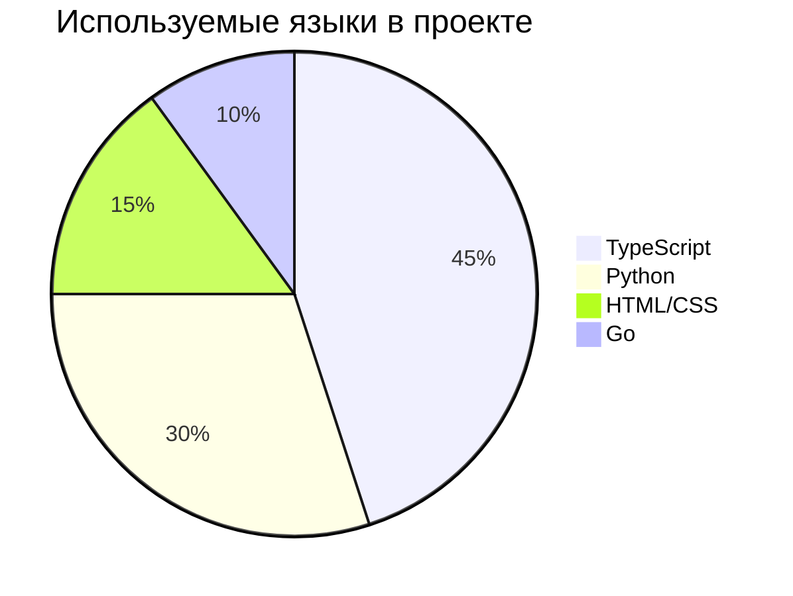

## 4. Блок-схема слева направо с подграфиками (Subgraphs)
Позволяет группировать элементы логически в отдельные визуальные блоки (кластеры).

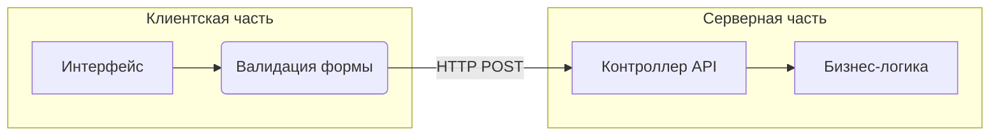

## 5. Стилизованная блок-схема (Кастомные цвета)
Пример изменения цвета блоков, обводки, текста и стрелок с помощью операторов `style` и классов.

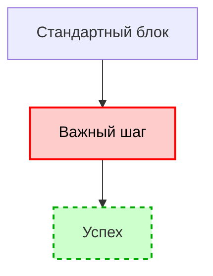

## 6. Диаграмма «Сущность-Связь» (ER-Diagram)
Используется в проектировании баз данных для описания таблиц, их полей (ключей) и связей между ними.

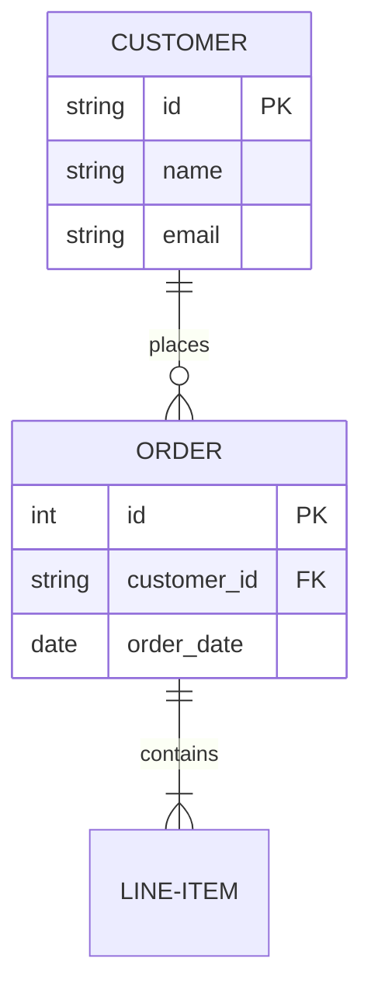

## 7. Ментальная карта (Mindmap)
Удобный инструмент для брейншторма, фиксации идей, создания структуры контента или планов.

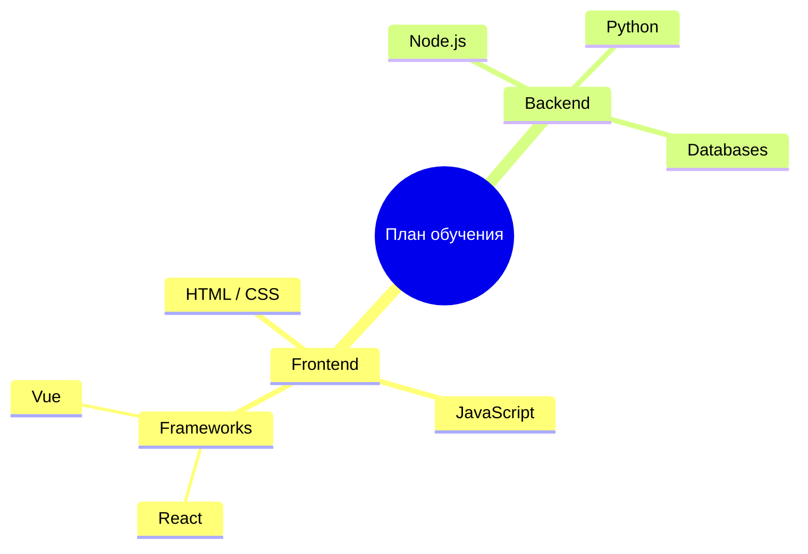

## 8. Диаграмма состояний (State Diagram)
Показывает жизненный цикл объекта или системы и условия перехода из одного состояния в другое.

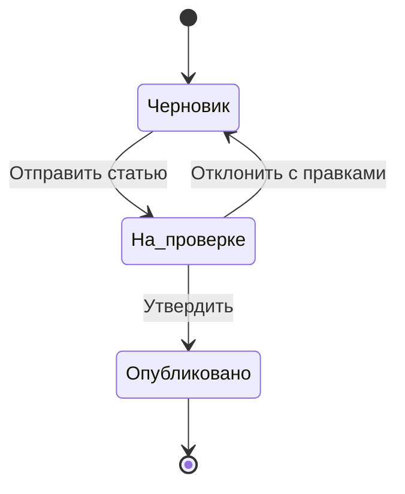

## 9. Диаграмма классов (Class Diagram)
Применяется в ООП (объектно-ориентированном программировании) для визуализации структуры кода, классов и методов.

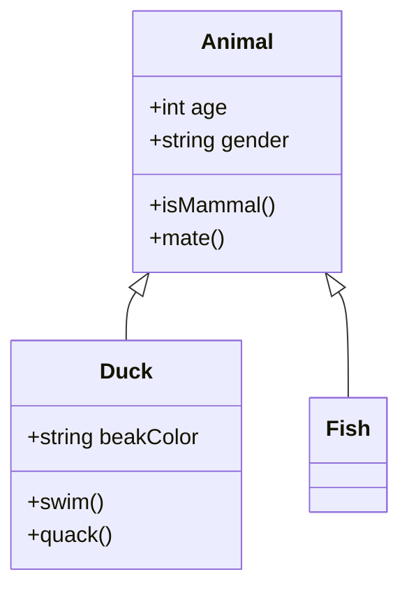

## 10. Карта пользовательского пути (User Journey)
Используется UX/UI-дизайнерами и маркетологами, чтобы разложить по шагам действия пользователя и его эмоции.

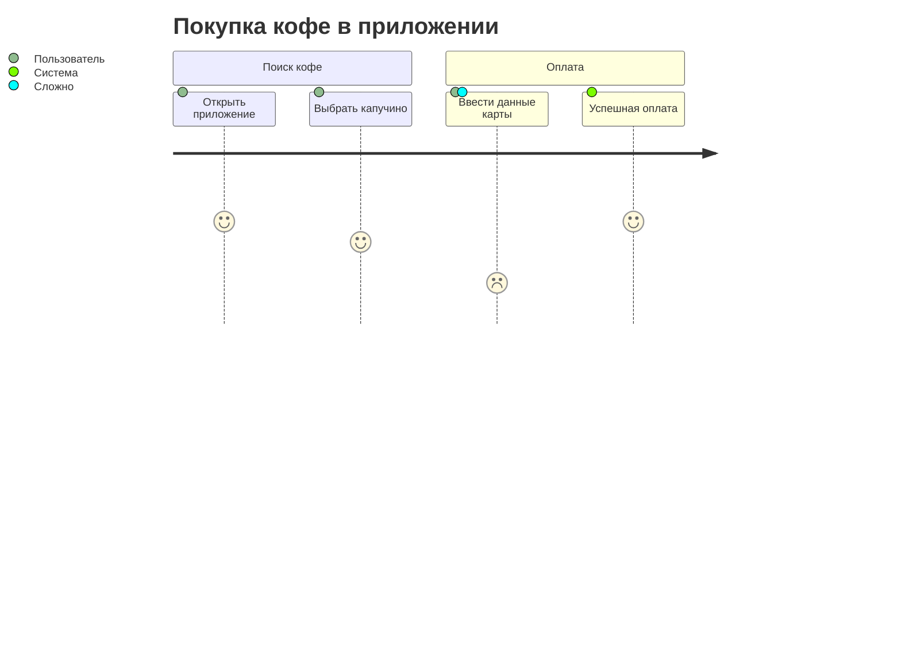

## 11. Квадрант-диаграмма (Quadrant Chart)
Помогает распределять задачи, продукты или риски по матрице 2х2 (например, Важно/Срочно).

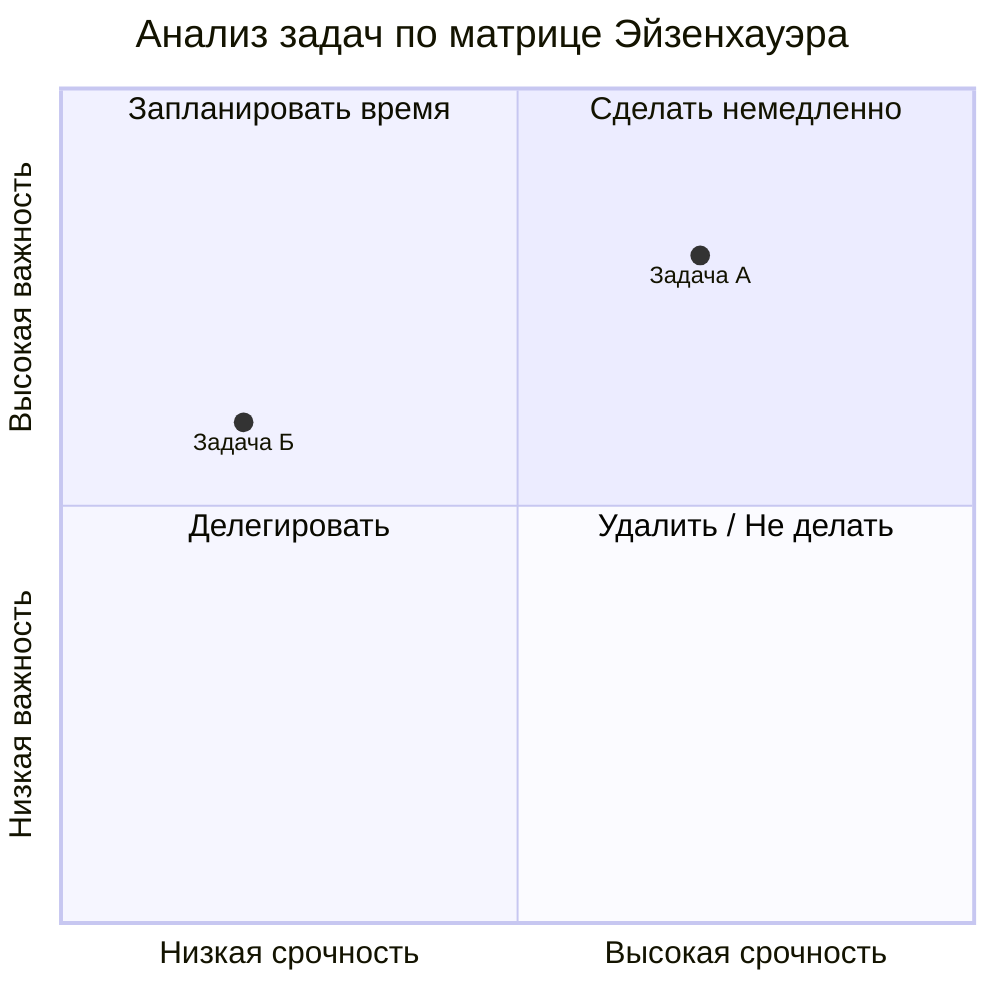

## 12. Хронология (Timeline)
Наглядная шкала для отображения исторических событий, дорожных карт (Roadmaps) или релизов по годам.

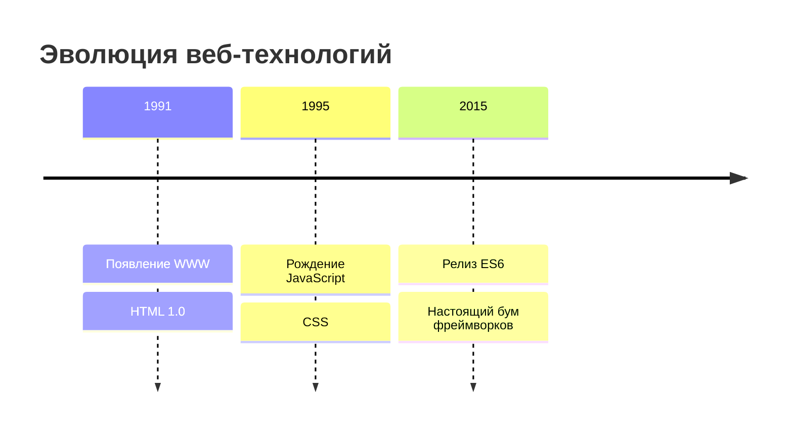